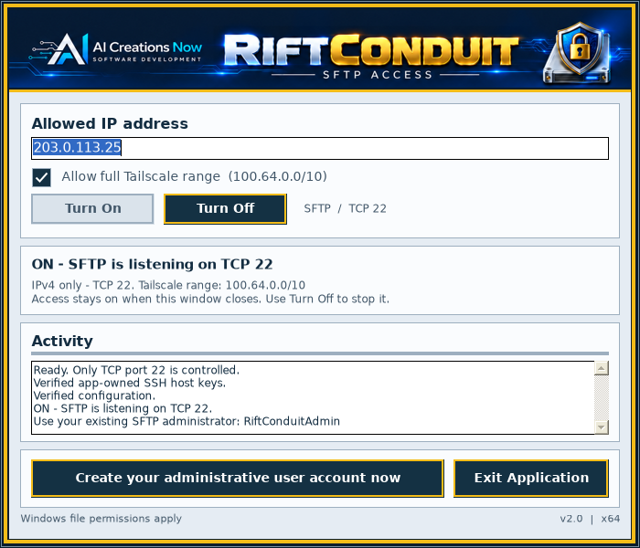
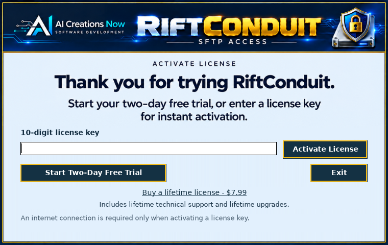

<h1 align="center">Rift Conduit</h1>

<strong>A direct line to your own Windows storage.</strong>

  

  <a href="https://riftconduit.com/">Official website</a> ·
  <a href="https://download.aicreatenow.com/software/rift-Conduit2.0.0microsoftSigned.exe">Download for Windows</a> ·
  <a href="https://buy.stripe.com/6oU7sN0JB5l66c40Fw5kk0d">Buy lifetime license — $7.99</a> ·
  <a href="https://riftconduit.com/connection-guide.html">Connection guide</a>

Version 2.0 · Windows x64 · 48-hour free trial · No recurring Rift Conduit subscription

Rift Conduit gives your Windows PC or server a focused interface for encrypted SFTP file access. Keep your files on your own storage, connect with a separate SFTP client, and turn access on or off when you choose.

Built by **AI Creations Now Software Development**. This repository is the official product showcase and documentation hub. The application is proprietary; its source code is not included and this repository grants no open-source license for the application.

## Your storage. Your connection.

| What you need | How Rift Conduit helps |
| --- | --- |
| Reach files on a Windows PC or server | Browse, upload, download and manage files through a compatible SFTP client when the host is reachable. |
| Keep storage under your control | Files remain on your Windows host. No Rift Conduit cloud-storage plan is required. |
| Transfer files over an encrypted connection | The managed OpenSSH listener provides SFTP file access on TCP port 22. |
| Set up a connection without juggling several tools | Use one compact window for incoming IPv4 settings, account creation, listener status and activity. |
| Work with your preferred client | Use an SFTP file browser or a compatible remote-drive application, installed separately. |
| Keep access available while you work | An active listener continues after the window closes while the license or trial permits it. **Turn Off** stops it. |

## See Rift Conduit

  

**[View all screenshots](https://riftconduit.com/screenshots.html)** · **[Watch the product walkthrough](https://download.aicreatenow.com/media/aicreatenow/rift4kfast.mp4)**

Preview the trial and activation screen

  

## Start with two days. Keep it for life.

The free trial lasts **48 elapsed hours from selecting Start Trial** in the app. Downloading or installing does not start the clock or open remote access.

A **$7.99 one-time purchase** provides a lifetime license for the activated computer, including lifetime technical support and lifetime upgrades. Enter the supplied ten-digit key in the app to activate. Internet access is required for activation; routine registered operation checks the saved license locally.

**[Download the Windows installer](https://download.aicreatenow.com/software/rift-Conduit2.0.0microsoftSigned.exe)** · **[Purchase through Stripe](https://buy.stripe.com/6oU7sN0JB5l66c40Fw5kk0d)** · **[Trial and license details](https://riftconduit.com/docs/LICENSE-INFORMATION.txt)**

Keep your license key for reactivation after uninstalling and reinstalling. Reinstalling does not restart the trial.

## Get connected

**Use the official installer linked above.** GitHub’s **Code → Download ZIP** contains this repository’s documentation and artwork, not the Windows application.

1. **Install on the Windows computer holding your files.** Start the trial or activate your license.
2. **Set the allowed incoming address.** Enter the source IPv4 address of the client computer or network you connect from. The optional Tailscale allowance is for a Tailscale network you have configured separately.
3. **Turn on SFTP and authorize your account.** Create a dedicated local administrator account through the app, or follow the guide to authorize an intended existing local account.
4. **Connect from your other computer.** In your separate SFTP client, use the host's reachable address, port **22**, and the authorized Windows account. Verify the host-key fingerprint before accepting the first connection.

**[Quick start](QUICKSTART.md)** · **[Complete connection guide](https://riftconduit.com/connection-guide.html)** · **[Setup and help](https://riftconduit.com/help.html)**

## Requirements

| Item | Requirement |
| --- | --- |
| Windows host | Windows 11 x64 or Windows Server 2022/2025 with Desktop Experience |
| Permissions and runtime | Administrator access and .NET Framework 4.7.2 or newer |
| OpenSSH preparation | Bundled matching sources cover Windows 11 Home/Pro 22H2–25H2 and Windows Server 2022/2025; compatible existing OpenSSH is reused |
| Network | Reachable IPv4 connection to the host on TCP port 22; router forwarding or cloud firewall configuration may be needed |
| Client | A separately installed compatible SFTP file browser or remote-drive application |
| Activation | Internet access for explicit license activation |

Server Core and domain controllers are not supported. A Windows restart may be required during component preparation. See the **[full installation requirements](https://riftconduit.com/download.html#requirements)** before installing.

## How access works

- **SFTP file access:** the managed listener does not provide an SSH terminal, remote desktop or port forwarding. Rift Conduit is not a cloud backup or file-sync service.
- **Windows permissions:** authorized accounts access files according to their Windows permissions. Accounts created by Rift Conduit are local administrators with broad access; they are not confined to a single folder.
- **Additive firewall rules:** Rift Conduit adds its own allowance for the selected incoming IPv4 address and, optionally, the Tailscale IPv4 range. Existing firewall rules and policies remain in effect and can allow other addresses or block a connection.
- **Separate network setup:** Rift Conduit does not install or configure Tailscale or arrange router forwarding. The host must already be reachable through your chosen network route.
- **Clear stop control:** closing the window leaves active access running. **Turn Off** stops the managed listener and sessions and removes this product's firewall rules, while retaining settings, host keys and accounts. The trial deadline still applies while the window is closed.

## Privacy and support

Rift Conduit does not send your drive contents or SFTP account password to AI Creations Now Software Development. Explicit license activation sends the information described in the privacy policy to the licensing service; normal registered operation checks the saved license locally.

Account creation writes a separate Desktop credentials file containing the account password. Its permissions are restricted, but anyone who can read it has the credentials. Keep it secure or remove it when no longer needed.

**[Support guide](SUPPORT.md)** · **[Version notes](CHANGELOG.md)** · **[Privacy policy](https://riftconduit.com/privacy.html)** · **[License information](https://riftconduit.com/docs/LICENSE-INFORMATION.txt)** · **[Email support](mailto:info@AICreateNow.com)**

Please keep license keys, passwords and private connection details out of public GitHub issues. Send private support questions to **info@AICreateNow.com**.

---

**[AI Creations Now Software Development](https://aicreatenow.com/)** · **[RiftConduit.com](https://riftconduit.com/)**

Copyright © 2026 AI Creations Now Software Development. All rights reserved. Third-party names belong to their respective owners.
